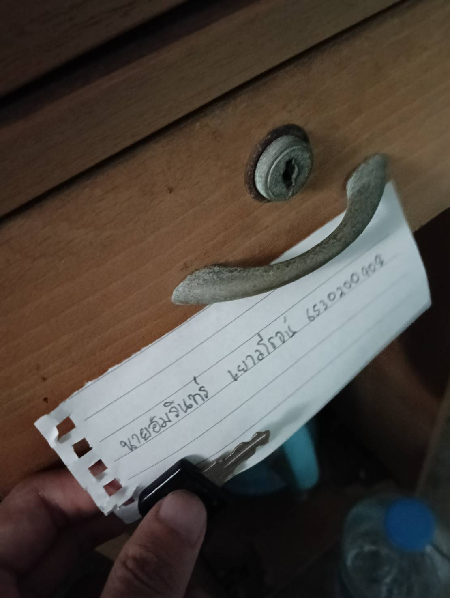

# Security_Control
[Back](https://6530200908.github.io)

- *กลอนลิ้นชัก*
- *สถานที่*: หอพักนิสิต ตึก3 ห้อง3107
- *control function* : Preventive Control
- *Type of Security Control* : Physical Control
- กลอนล็อคจะเป็นตัวล็อคลิ้นชัก จะช่วยให้คนนอกไม่สามารถลิ้นชักได้ เป็นการรักษาความปลอดภัยระดับหนึ่ง โดยคนที่มีลูกกุญแจที่เป็นkeyของตัวล็อคเท่านั้นที่จะสามารถไขเปิดลิ้นชักมาได้ โดยที่ Physical Control คือ การใช้ลูกกุญแจในการlockและunlock และ Preventiuve Control คือ การที่ไม่ให้คนอื่น ที่ไม่ได้ถือ Key เปิดลิ้นชักได้

