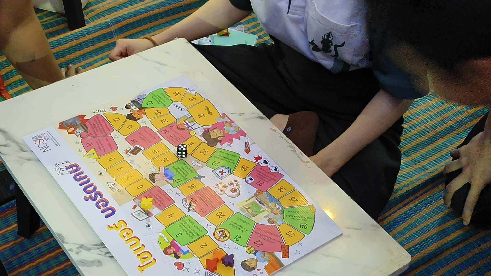
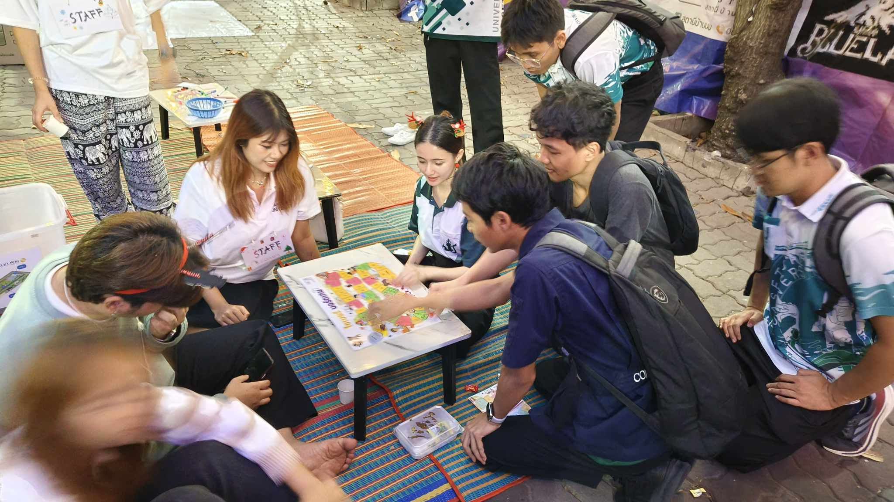
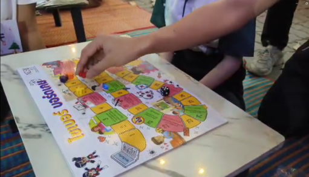

# Securing the Human
______________________________________________________________________________________
## Group : Kraprao Mhookrob Kaidao 

กิจกรรมนี้จัดขึ้นโดยกลุ่ม “Kraprao Mhookrob Kaidao” ซึ่งเป็นนิสิตสาขา Computer Science โดยใช้บอร์ดเกมของสำนักงานคณะกรรมการการรักษาความมั่นคงปลอดภัยไซเบอร์ (สกมช.) เพื่อสร้างความตระหนักรู้และเสริมสร้างทักษะด้านการรักษาความมั่นคงปลอดภัยไซเบอร์ให้กับเด็กและเยาวชน

โดยกลุ่มของพวกเราได้รับความสนใจจากสมาชิกของสภานิสิตในการเล่นและได้ขออนุญาตในการถ่ายวิดิโอจากผู้เข้าร่วมกิจกรรมแล้วซึ่งมีผู้เล่นทั้งหมด 4 คน(ผู้เล่น 2 คน และสมาชิกในกลุ่ม 2 คน)ในระหว่างทำกิจกรรมได้มีการพูดคุย แลกเปลี่ยนความคิดเกี่ยวกับหลักปฏิบัติ รวมถึงกฎหมายต่างๆที่เกี่ยวข้องกับองค์ความรู้ที่ได้จากบอร์ดเกมอีกด้วย

### *บรรยากาศกิจกรรม (Video)*

(เมื่อวันที่ 21 ธันวาคม 2567 เวลาประมาณ 19.00 น. ณ บริเวณ ตึก 9 มหาวิทยาลัยเกษตรศาสตร์ วิทยาเขตศรีราชา)

### *เพื่อนร่วมอุดมการณ์*

1. [Suphanimit Nilchawee](https://6530200517.github.io/boardgame)

2. [Panupong Thongchoed](https://6530200339.github.io/boardgame)

3. [Kasidid Yookong](https://kasidid-y.github.io/boardgame)

4. [Punnakan Punsiri](https://qlerdev.github.io/boardgame)

[my profile](https://6530200908.github.io/)
